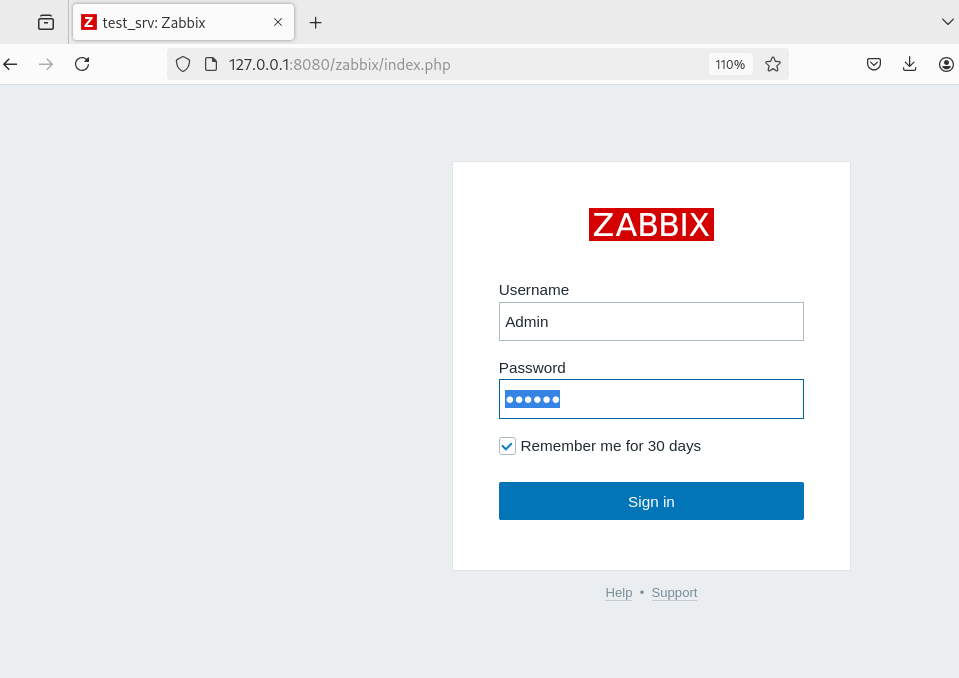
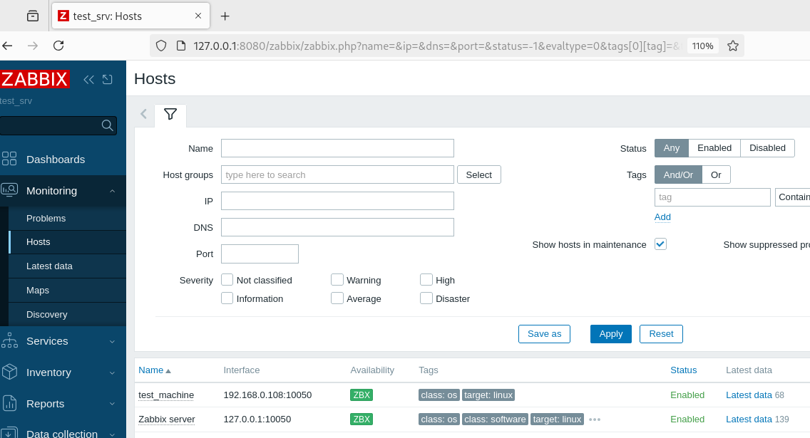
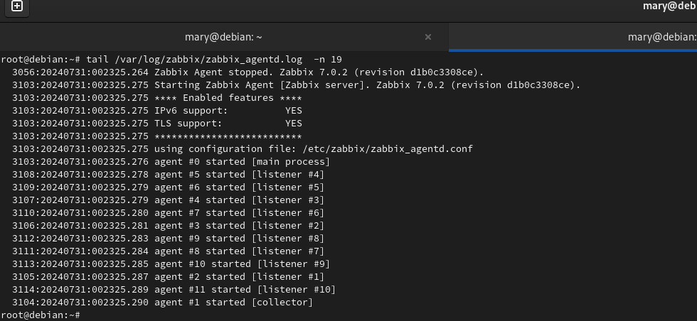
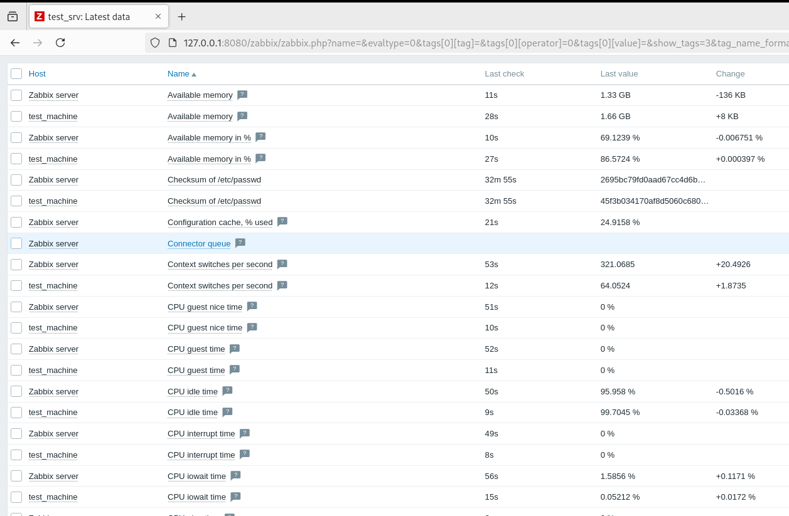

# Домашнее задание к занятию "Система мониторинга Zabbix" - Варфоломеева Марьяна

### Задание 1

#### Скриншот админки Zabbix:



#### Для установки Zabbix-сервера были использованы следующие команды:

1. Установка СУБД PostgreSQL:

```
# apt install postgresql
```

2. Установка репозитория zabbix:
```
# wget https://repo.zabbix.com/zabbix/7.0/debian/pool/main/z/zabbix-release/zabbix-release_7.0-2+debian12_all.deb
# dpkg -i zabbix-release_7.0-2+debian12_all.deb
# apt update 
```
3. Установка Zabbix сервера и веб-интерфейса:

```
apt install zabbix-server-pgsql zabbix-frontend-php php8.2-pgsql zabbix-apache-conf zabbix-sql-scripts
```
4. Установка и запуск сервера базы данных:

```
# sudo -u postgres createuser --pwprompt zabbix
# sudo -u postgres createdb -O zabbix zabbix 
```

5. Импорт схемы данных:
```
# zcat /usr/share/zabbix-sql-scripts/postgresql/server.sql.gz | sudo -u zabbix psql zabbix 
```

6. Установка пароля DBPassword в файле zabbix_server.conf:
```
sed -i 's/# DBPassword=/DBPassword=123456/g' /etc/zabbix/zabbix_server.conf
```

7. Запуск Zabbix-сервера:
```
# systemctl restart zabbix-server apache2
# systemctl enable zabbix-server apache2 
```

### Задание 2

1. Cкриншот раздела Configuration > Hosts. Поле Availability подсвечивается зеленым индикатором:



2. Скриншот лога zabbix agent:



3. Cкриншот раздела Monitoring > Latest data для обоих хостов:



4. Использованные команды:

* Для установки zabbix агента используется тот же репозиторий, что и для сервера:
```
# wget https://repo.zabbix.com/zabbix/7.0/debian/pool/main/z/zabbix-release/zabbix-release_7.0-2+debian12_all.deb
# dpkg -i zabbix-release_7.0-2+debian12_all.deb
# apt update 
```

* Установка Zabbix-агента:

```
 # apt install zabbix-agent
```

* Настройка адреса Zabbix-сервера в zabbix_agentd.conf:
```
sed -i 's/Server=127.0.0.1/Server=192.168.0.115/g' /etc/zabbix/zabbix_agentd.conf
```

* Запуск агента:

```
# systemctl restart zabbix-agent
# systemctl enable zabbix-agent 
```


